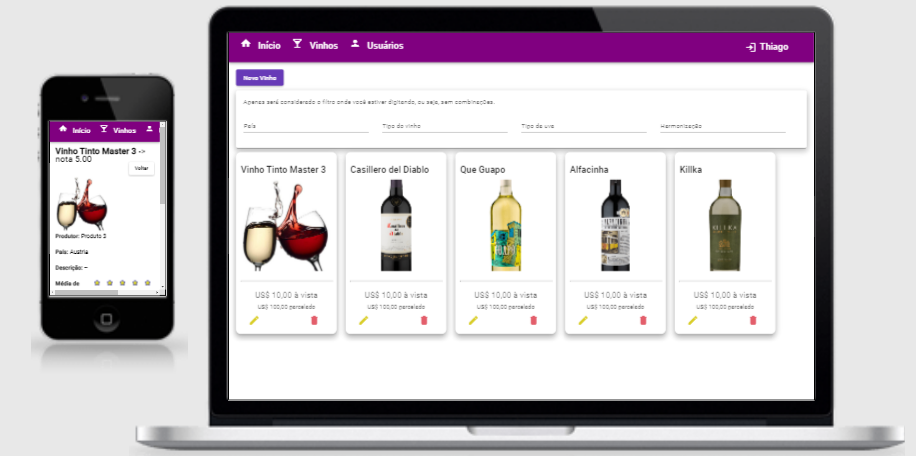

<h1 align="center">
    
</h1>

<h4 align="center">
    :computer: Aplicação para cadastramento de vinhos
</h4>

    <a href="#-projeto">Projeto</a>&nbsp;&nbsp;&nbsp;|&nbsp;&nbsp;&nbsp;
    <a href="#rocket-tecnologias">Tecnologias</a>&nbsp;&nbsp;&nbsp;|&nbsp;&nbsp;&nbsp;
    <a href="#user-content-clipboard-instruções">Instruções</a>

 

## 💻 Projeto

Frontend App em Angular. Aplicação frontend para cadastramento de vinhos, autenticação de usuário e comentários sobre os vinhos

 

## :rocket: Tecnologias

- [Angular](https://angular.io/) 
- [Material](https://material.angular.io/)
- [Typescript](https://www.typescriptlang.org/)
- [HTML5](https://developer.mozilla.org/pt-BR/docs/Web/Guide/HTML/HTML5)
- [CSS3](https://developer.mozilla.org/pt-BR/docs/Web/CSS)
- [SCSS/SASS](https://sass-lang.com/)

## :clipboard: Instruções

----
### INTERFACE - FRONTEND

- Execute `$ yarn` para instalar todas as dependencias.
- Caso tenha alterado o endereço da API backend, navegue até  `vivinio-front\src\environments` a abra o arquivo  `environment.ts`. Em  `apiUrl: 'http://localhost:4000';`, coloque o novo endereço. 
- Após todas as dependencias serem instaladas, Pronto! Basta executar  `yarn start` para iniciar a interface frontend.
